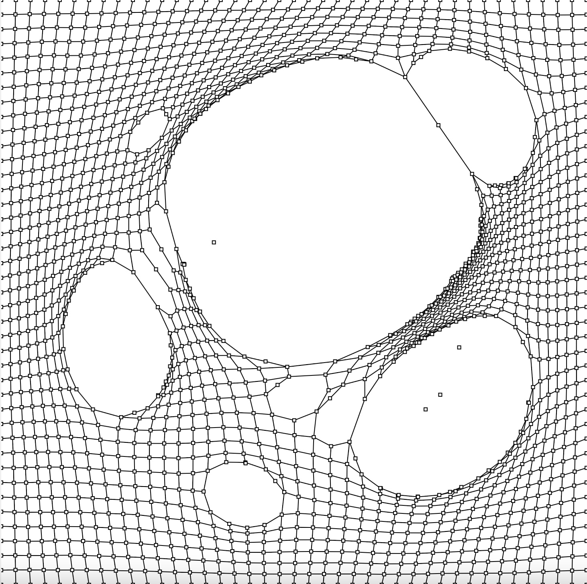

# tut4-quiz8
git config --global core.autocrlf true

Quiz 8

## Part 1
- I found designer water_shed's touch-sensitive interactive design and was interested in it.
- This piece inspired my design. The principle of this interaction design work is that when participants change the state of their hands in front of the screen, they can use gestures to control the interaction design, and the water mist and ripples in the screen will change accordingly. At the same time, the interaction design uses bold, bright colors to visually break the repression and dullness brought by black and white ink.
- [a pic of water shed](water_shed.jpg)
- [a gif of water shed](water_shed.GIF)

## PART 2
- In PART 1 I was inspired to bloom. In coding techniques Ifound bloom-like techniques for interacting with the mouse.
- 
- [link] http://openprocesing.org/sketch/2135557
- The code is in the third icon in the middle of the page.